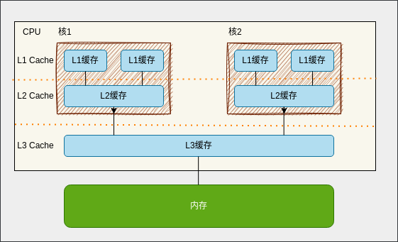

## 什么是原子操作

&emsp;&emsp; 原子通常是指化学反应中不可分割的最小单位，顾名思义，**原子操作** 则是指在执行过程中不会被中断的操作，**要么执行成功，要么执行失败**，不会出现执行一半的情况。

&emsp;&emsp; 现在我们思考一下`++`、`--`、`+=`、`-=`这些操作是不是原子操作，要判断他们是否是原子操作，我们根据上述的定义来就可以。~~显然这些操作都是要么执行成功，要么执行失败的，所以这些操作都是原子操作。~~(这里有个坑，后面会讲到)。
这些操作确实也只需要一个 CPU 指令就可以完成，但不能简单的就把他们认为是原子操作。

&emsp;&emsp; 上面的操作在单核 CPU 上确实是原子操作，但是在多核 CPU 上就不是了，因为多核 CPU 上的每个核都有自己的缓存，**当多个核同时对同一个变量进行操作的时候，就会出现数据不一致的情况**，这就是所谓的**缓存一致性**问题。下面我们就来聊聊缓存一致性问题吧。

### 缓存一致性问题

&emsp;&emsp; 对于 CPU 而言，它从寄存器文件中读数据比从主存中读取几乎要快 100 倍。随着这些年半导体技术的进步，这种处理器与主存之间的差距还在持续增大。针对这种处理器与主存之间的差异，系统设计者采用了更小更快的存储设备，称为高速缓存存储器（cache memory，简称为 cache 或高速缓存），作为暂时的集结区域，用来存放处理器近期可能会需要的信息。

&emsp;&emsp; CPU Cache 通常分为三级缓存：L1 Cache、L2 Cache、L3 Cache，级别越低的离 CPU 核心越近，访问速度也快，但是存储容量相对就会越小。其中，在多核心的 CPU 里，每个核心都有各自的 L1/L2 Cache，而 L3 Cache 是所有核心共享使用的。

#### 参考文献

https://hansimov.gitbook.io/csapp/ch01-a-tour-of-computer-systems/1.5
https://www.xiaolincoding.com/os/1_hardware/cpu_mesi.html
